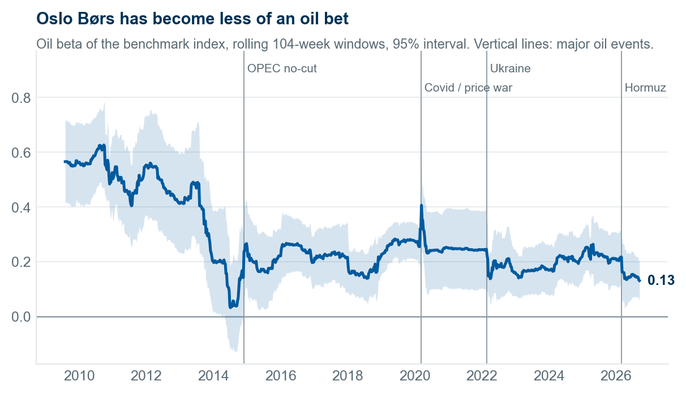
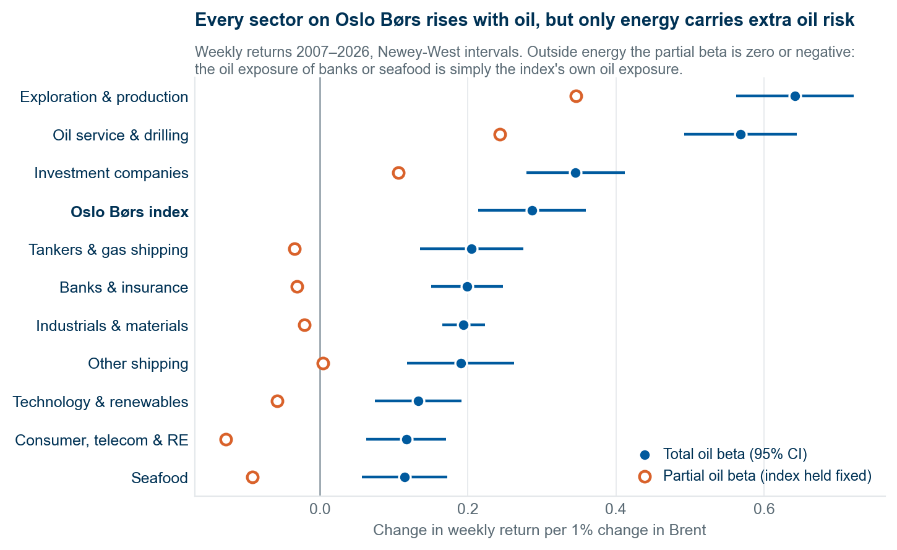
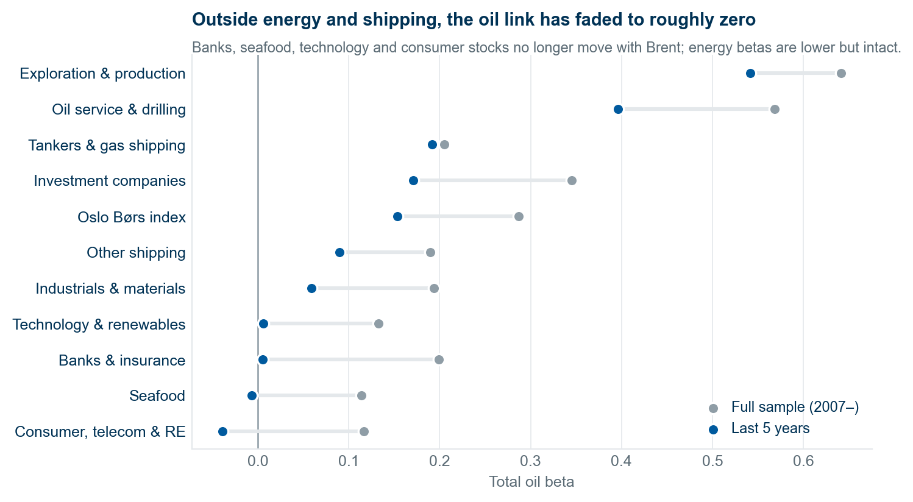
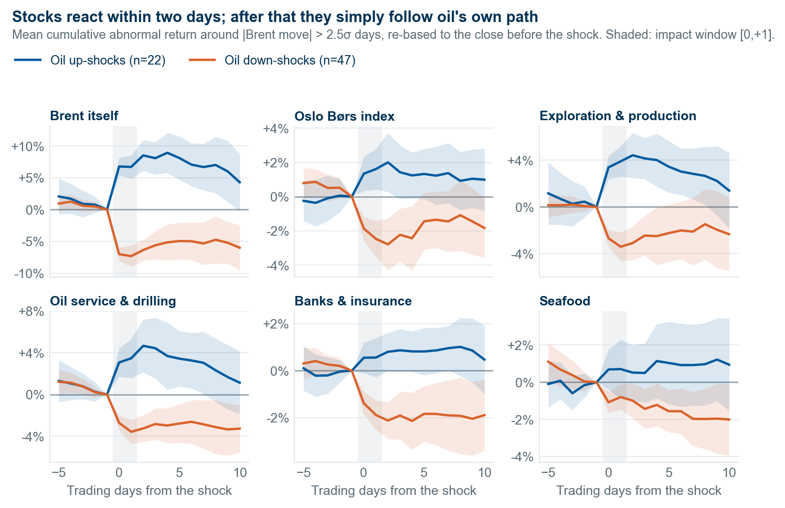
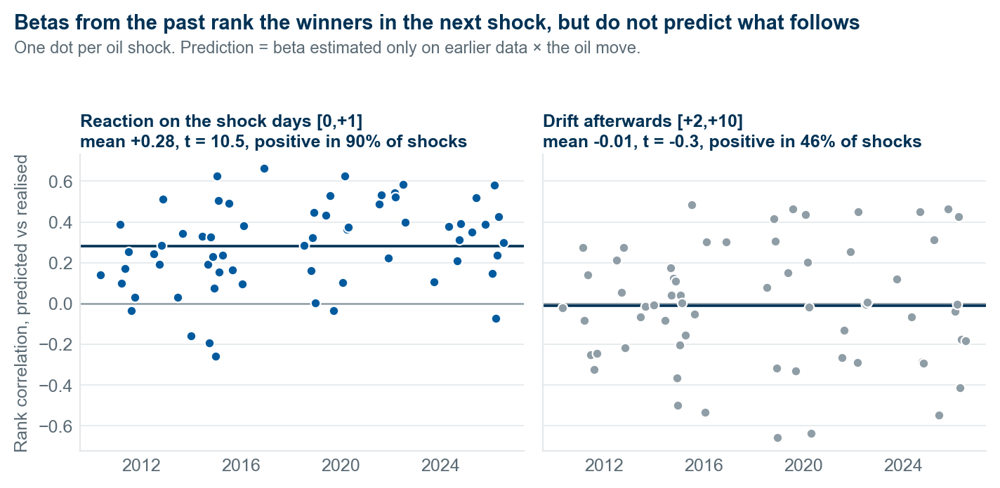
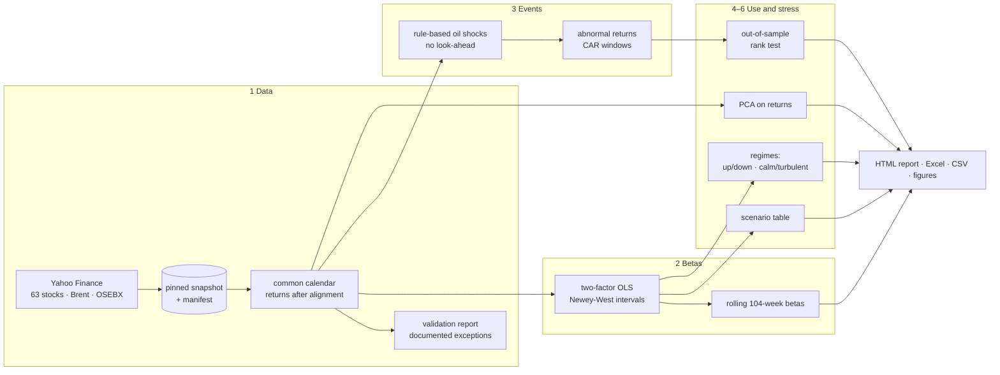

# How much oil is left in Oslo Børs?

[](https://github.com/oscarschjelderup-sketch/oslo-oil-sensitivity/actions/workflows/ci.yml)
[](https://github.com/oscarschjelderup-sketch/oslo-oil-sensitivity/actions/workflows/live-monitor.yml)

**Live monitor, rebuilt after every trading day: https://oscarschjelderup-sketch.github.io/oslo-oil-sensitivity/**

**A factor study of 63 Norwegian stocks and 10 sectors, 2007–2026: how much each one moves when Brent moves, how sure
we can be about it, and whether that knowledge survives an out-of-sample test.**

```bash
oilbeta run
```



Everyone "knows" Oslo Børs is an oil market. This project measures it properly and finds that the statement is about a
decade out of date: the benchmark's oil beta averaged **0.49** up to 2013 and is **0.13** today. Outside energy and
shipping, the link to oil over the last five years cannot be told apart from zero.

| | |
|---|---|
|  |  |
|  |  |

The full write-up is the [research report](https://oscarschjelderup-sketch.github.io/oslo-oil-sensitivity/paper/report.html); every number behind it is in
[results/tables/](results/tables) and in the workbook attached to the [latest paper release](https://github.com/oscarschjelderup-sketch/oslo-oil-sensitivity/releases/latest).

## Findings

1. **The oil beta of Oslo Børs has fallen from 0.49 to 0.13.** Over the full sample a 10% move in Brent has come with a
   2.9% move in the index (95% interval 2.1–3.6%).
2. **Only energy carries oil risk beyond the index.** Once the index is held fixed, 16 of 63 stocks keep a significantly
   positive oil beta, and 15 of them are E&P or oil service. Seventeen have a significantly *negative* partial beta, led
   by Norwegian Air Shuttle (−0.32), where fuel is a cost.
3. **Oil shocks are priced within two days.** Across 69 rule-based shocks the reaction lands on the shock day and the
   day after. Betas measured only on those days agree with ordinary weekly betas (correlation 0.89 across stocks).
4. **Sensitivity is stable; predictability is absent.** Betas estimated only on past data rank stocks correctly in the
   *next* shock: mean rank correlation +0.28 (t = 10.5), positive in 90% of shocks. The same ranking says nothing about
   the days that follow (−0.01, t = −0.3). This is a risk tool, not a trading signal, and the report says so.
5. **The downside beta is larger.** The index's oil beta is 0.37 in weeks when oil falls and 0.19 when it rises
   (p = 0.012), because large oil declines tend to be demand scares that hit all equities.

## Two modes: a pinned paper and a live monitor

| | `oilbeta run` | `oilbeta live` |
|---|---|---|
| Purpose | The research report: numbers that can be cited and reproduced | The monitor: how much oil is in Oslo Børs *now* |
| Sample end | Fixed in the config | Yesterday's close, every time it runs |
| Output | `results/` (committed): narrative report, figures, workbook | `live/` (git-ignored): interactive dashboard, tables, workbook |
| Text | Written findings, checked against the snapshot | No hard-coded claims: every sentence is assembled from the numbers |

`oilbeta live` re-downloads prices, re-estimates every beta, re-runs the event study and rebuilds
`live/dashboard.html`, a single self-contained page with a Brent what-if slider, rolling betas with intervals for any
stock, and a predicted-versus-realised scorecard that gains a row each time Brent has a shock. A new shock enters as
soon as its two-day impact window exists; its drift window stays empty until those days have happened, never a partial
sum. If the download fails, the last good snapshot is served and the page says so.

### How it runs

GitHub Actions is the run model; nothing has to be switched on anywhere.

- [live-monitor.yml](.github/workflows/live-monitor.yml) runs at 05:30 UTC the morning after each trading day (and on
  every change to the code): it installs the locked environment, runs `oilbeta live --retries 3` and deploys the page,
  the pinned report and the workbook to GitHub Pages. Yahoo sometimes throttles cloud IPs, so the last good price
  snapshot is kept in the Actions cache and served, visibly marked, when a download fails. The job only goes red when
  the page has been stale for more than a week.
- [ci.yml](.github/workflows/ci.yml) lints and runs the test suite on every push and pull request.
- For a local refresh on a schedule there is [scripts/update_live.ps1](scripts/update_live.ps1) (Windows Task Scheduler).

## What it does



| Step | Question | Method |
|---|---|---|
| 1 Data | Can the inputs be trusted and reproduced? | Fixed end date, SHA-256 manifest, returns computed *after* calendar alignment, equal-weighted sector portfolios from constituents only, every manual fix listed in the config with its reason |
| 2 Betas | How much does each stock move with oil? | `r = α + β_mkt·OSEBX + β_oil·Brent + ε` on weekly returns, Newey-West errors, full-sample and rolling. Reports a *partial* and a *total* oil beta (see below) |
| 3 Events | What happens when oil jumps? | Shocks = Brent moves above 2.5 trailing σ, de-clustered; market-model abnormal returns; CARs over [−5,−1], [0,+1], [+2,+10] |
| 4 Scenarios | What should I expect if Brent moves 10%? And should I believe it? | Expected move with interval from recent betas, the probability the stock actually moves that way, and an out-of-sample rank test on shocks the betas never saw |
| 5 Regimes | Is the beta the same up and down, calm and turbulent? | Split-beta regressions with equality tests; regime flags use only past information |
| 6 PCA | Do returns alone reveal an oil factor? | PCA on the cross-section of weekly returns (not on engineered columns) |

### Partial versus total oil beta

Oslo Børs is itself oil-heavy, so controlling for the index hides part of every stock's oil exposure inside its market
beta. The project therefore reports two numbers that answer two questions:

- **Partial beta**: the index enters the regression as it is. *Does this stock carry oil risk beyond what the index
  already has?* For DNB the answer is no (−0.07).
- **Total beta**: the index is first stripped of its own oil component. *If Brent moves 10%, what happens to this
  stock through every channel?* For DNB over the full sample: +0.29.

They are tied by an identity that the test suite checks to machine precision:
`total = partial + β_mkt × (the index's own oil beta)`.

## Quick start

```bash
uv sync --extra dev         # exact, locked environment (uv.lock); or: pip install -e ".[dev]"
oilbeta run                 # all six steps on the pinned snapshot -> results/
oilbeta live                # same model on prices up to yesterday -> live/dashboard.html
oilbeta fetch               # data snapshot + validation report only
oilbeta stock NAS.OL        # one stock, including tickers outside the configured universe
pytest tests/unit           # 45 fast tests (~5 s); plain `pytest` adds the two golden tests (~1 min)
ruff check .                # lint
```

`oilbeta run --refresh` downloads a new snapshot. Without it the cached snapshot is reused, so results are identical
from run to run. Everything that shapes the results lives in three validated files under [configs/](configs):
[study.yaml](configs/study.yaml) (sample, factors, windows, thresholds), [universe.yaml](configs/universe.yaml)
(stocks and sectors) and [data_exceptions.yaml](configs/data_exceptions.yaml) (every manual data fix, with its
reason). Unknown keys, impossible windows, a ticker in two sectors or a data fix without a reason stop the run.

## Design decisions worth defending

- **Weekly returns for betas, daily for events.** Oslo closes about six hours before Brent settles. Friday-to-Friday
  returns dilute that gap and the stale prices of small caps; the event study handles it by using a two-day impact
  window.
- **Standard errors written out in numpy.** OLS and the Newey-West covariance are ~40 lines in
  [regression.py](src/oilbeta/regression.py), tested against scipy, against White's estimator at lag zero and against
  a naive double-loop implementation.
- **Flags, never silent fixes.** The validation step found four vendor errors (an unadjusted NOK 21 extraordinary
  dividend in Aker Solutions that shows up as a −41% day, two mis-applied share consolidations) and one ticker whose
  early history is a different company (Nel was DiaGenic until 2014). Each is removed by an explicit line in the config.
  Real crashes (Norwegian 2020, Frontline 2011) stay in.
- **No look-ahead anywhere.** Shock thresholds use volatility up to the day before; regime flags use an expanding
  median; out-of-sample betas use only weeks that ended before each event. Each has a test that tampers with the
  future and checks the past does not change.
- **The numbers are locked twice.** `uv.lock` pins every dependency, and two golden tests pin the results: one re-runs
  the study on the pinned snapshot and compares 22 headline numbers with the README (wherever the raw prices exist),
  the other pushes a seeded synthetic market through the whole chain, report and dashboard included, on every push.
  A refactor cannot move a number without a test going red.
- **Null results are reported.** The drift test and the volatility-regime split find nothing, and the report shows them.

## What this study cannot tell you

- **Survivorship.** The universe is today's listings with Yahoo history. PGS, Seadrill, Golden Ocean and Flex LNG are
  no longer on Yahoo's Oslo feed, so the sample is tilted towards survivors.
- **Co-movement, not causation.** Brent moves for demand and supply reasons. Down-shocks in particular are preceded by
  a weak index (−1.4% over the prior five days), the signature of demand scares.
- **Equal weights, hand-made sectors.** Sector portfolios are not investable indices.
- **USD oil, NOK stocks.** The krone's own oil sensitivity is part of the total beta by design.
- **Index history is spliced.** OSEBX on Yahoo starts in 2013; earlier returns come from OSEFX (0.99 return
  correlation in the 625-day overlap, re-checked on every fetch).

Methodology in full: [docs/methodology.md](docs/methodology.md).

## Repository layout

```
configs/
  study.yaml               sample, factors, windows, thresholds
  universe.yaml            63 stocks in 10 sectors
  data_exceptions.yaml     every manual data fix, with its reason
src/oilbeta/
  config.py                pydantic models: the three files are validated before anything runs
  data/                    snapshot.py (download, manifest) · align.py (calendar, returns, sectors) · validate.py
  stats/                   ols.py · hac.py: numpy only, arrays in and numbers out
  analysis/                betas · events · scenarios · regimes · pca
  outputs/                 tables · figures · report · dashboard · templates/
  pipeline.py  cli.py      the six steps in order, and the `oilbeta` command
tests/
  unit/                    config, data, stats, analysis, live mode: synthetic data with known answers
  integration/             golden tests: the pinned snapshot's numbers, and a synthetic market end to end
docs/
  methodology.md           every formula and parameter
  decisions/               six short notes on why it is built this way
.github/workflows/         ci.yml (lint + tests) · live-monitor.yml (scheduled rebuild + GitHub Pages)
scripts/update_live.ps1    optional local refresh
uv.lock                    locked environment
results/                   tables and figures of the pinned snapshot (the report and workbook are release assets)
live/                      output of `oilbeta live` (git-ignored, rebuilt on every refresh)
data/manifest.json         what was downloaded, when, and its SHA-256 (raw prices are not redistributed)
```

The layering is one-way: `stats` knows nothing about pandas or tickers, `analysis` knows nothing about files, and
`outputs` never computes a result. Why things are built the way they are is written down in
[docs/decisions/](docs/decisions/README.md).

Companion project: [equity-research-engine](../equity-research-engine), which turns a ticker into a sell-side style
deck, Excel model and dashboard. `oilbeta stock <ticker>` gives the oil-sensitivity line for the risk section of such a case.

Data: Yahoo Finance via `yfinance`. For education and research; not investment advice. MIT licence.
